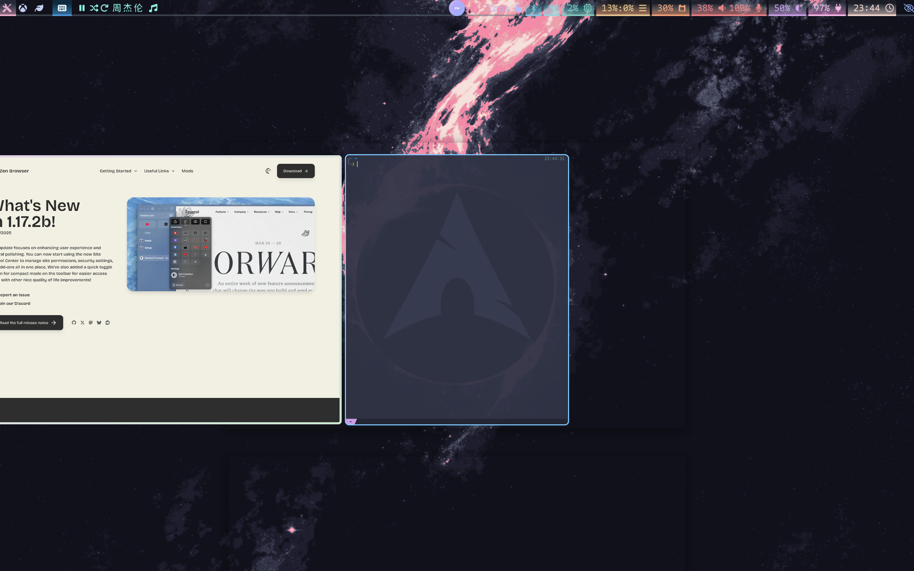

# dotfiles

<!--toc:start-->
- [dotfiles](#dotfiles)
  - [Softwares](#softwares)
  - [Todo](#todo)
<!--toc:end-->

my personal dotfiles

	

## Softwares

- [x] alacritty
- [x] bob
- [x] dunst
- [x] hyprland
- [x] joshuto or yazi
- [x] wluma
- [x] tmux and tqm
- [x] zsh
- [x] pipewire
- [x] wireplumber
- [x] grim, slurp, feh
- [x] xdg-desktop
- [x] tofi
- [x] docker
- [x] openssh
- [x] hyprpaper
- [x] bluetooth, blueman, pulseaudio-bluetooth
- [x] cpus-pdf, system-config-printer, hpuld for HP Laser 150 (printer)
- [x] pavucontrol
- [x] wps-office, ttf-wps-fonts, libtiff5
- [x] udiskie
- [x] electron-netease-cloud-music, mpd, ncmpcpp
- [x] waybar, otf-font-awesome
- [x] baidunetdisk
- [x] v2raya or clash-for-windows
- [x] neovim
- [x] cava (optional)
- [x] neovide (optional)
- [x] zotero
- [x] toDesk
- [x] visual-studio-code
- [x] zip, unzip
- [x] yazi and Überzug++ (some bug with ueberzugpp in hyprland)
    - [x] ffmpegthumbnailer
    - [x] unar
    - [x] jq
    - [x] poppler
    - [x] fd
    - [x] rg
    - [x] fzf (optional)
    - [x] zoxide (optional)
- [x] helix

Note: In `./dotfiles/zsh`, `zshrc` is just configuration files for zsh with only three plugins, and `zhsrc_omz` is for `oh-my-zsh`, just pick one to use. Recommend to use `zshrc`.

## Todo

- [ ] aliyunpan
- [ ] limit the length of music bar of waybar
